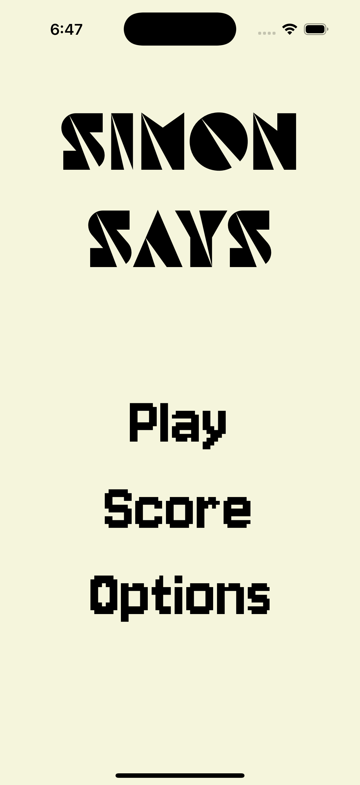
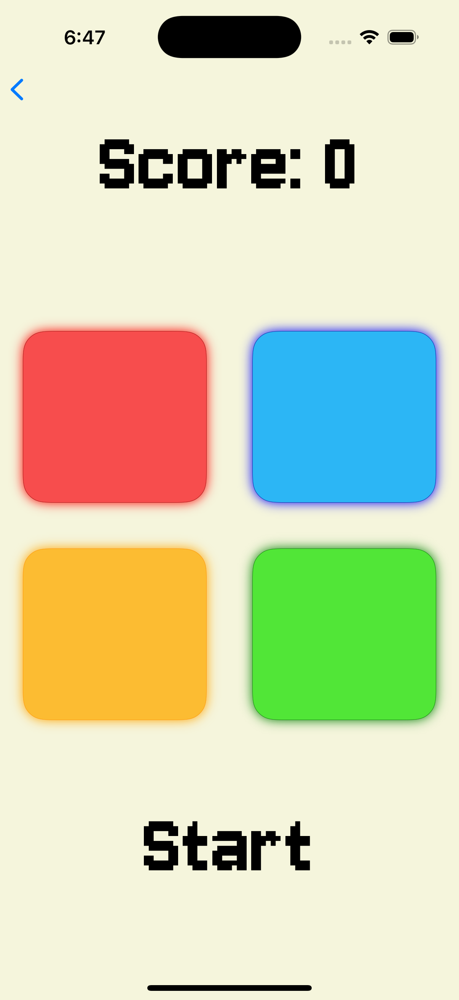
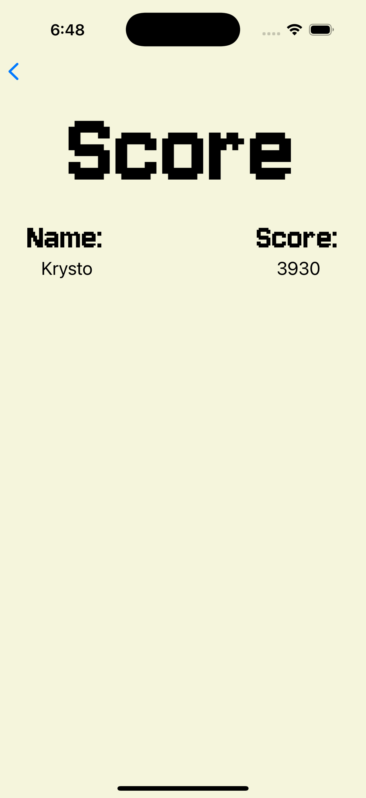
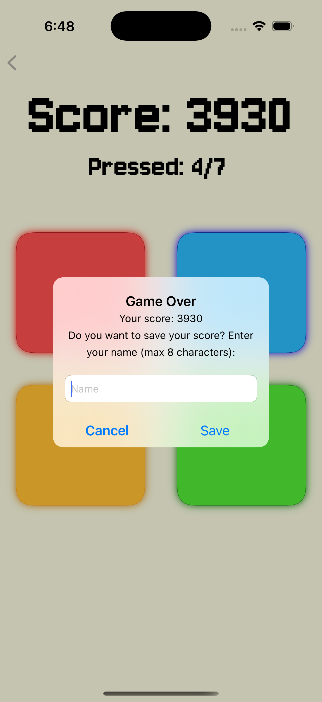

# SimonSays-.NET-Maui
A simple cross-platform implementation of the classic Simon Says memory game, developed during the second semester of my bachelor’s studies. The game challenges players to memorize and repeat an increasingly complex sequence of colors and sounds. Built using .NET MAUI, it runs on multiple platforms with a responsive UI and basic game logic, making it a beginner-friendly demonstration of cross-platform development principles.
Features:
Randomly generated color sequences.
Increasing difficulty as the game progresses.
Interactive, responsive UI using .NET MAUI controls.
Cross-platform compatibility (Windows, macOS, Android, iOS).

## Screenshot

  
  
  
  

